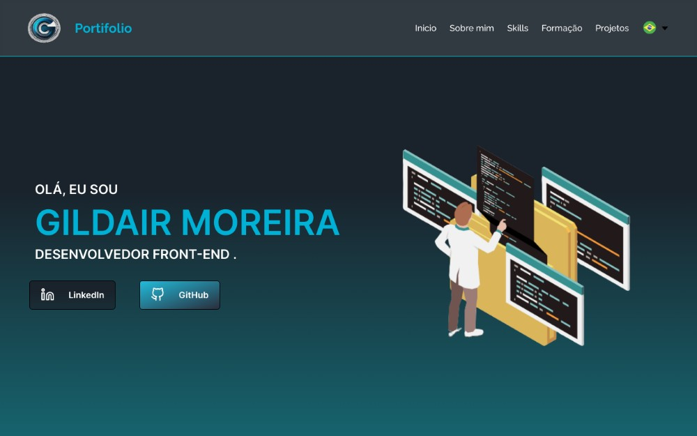

### Meu Portfólio

Este é o meu portfólio pessoal, desenvolvido com as tecnologias React, HTML, TypeScript e SCSS (Sass). Também foram utilizadas as bibliotecas React Icons, i18next, React Swiper e React Awesome Reveal.

## Tecnologias Utilizadas

- [React](https://reactjs.org/)
- [HTML](https://developer.mozilla.org/pt-BR/docs/Web/HTML)
- [TypeScript](https://www.typescriptlang.org/)
- [SCSS (Sass)](https://sass-lang.com/)
- [React Icons](https://react-icons.github.io/react-icons/)
- [i18next](https://www.i18next.com/)
- [React Swiper](https://swiperjs.com/react)
- [React Awesome Reveal](https://www.npmjs.com/package/react-awesome-reveal)

## Funcionalidades

- Página inicial com informações sobre mim e meus projetos
- Seção de projetos, com links para ver mais detalhes e acesso aos repositórios no GitHub
- Seção de habilidades técnicas
- Seção de contato, com links para minhas redes sociais e e-mail
- Tradução para os idiomas inglês e espanhol utilizando a biblioteca i18next
- Animações com a biblioteca React Awesome Reveal
- Responsividade para dispositivos móveis

## Como Rodar o Projeto

Para rodar o projeto em ambiente de desenvolvimento, siga os passos abaixo:

1. Clone o repositório para a sua máquina local
2. Abra a pasta do projeto no terminal e execute o comando `npm install` para instalar as dependências
3. Execute o comando `npm start` para rodar o projeto em modo de desenvolvimento
4. Abra o navegador e acesse o endereço `http://localhost:3000`

## Autor

Esse projeto foi desenvolvido por [seu nome aqui]. Entre em contato comigo pelo e-mail [seu email aqui] ou pelas minhas redes sociais (links na seção de contato do site).

## Licença

Este projeto está licenciado sob a Licença MIT - veja o arquivo [LICENSE](./LICENSE) para mais detalhes.

---

README criado por Gildair.
